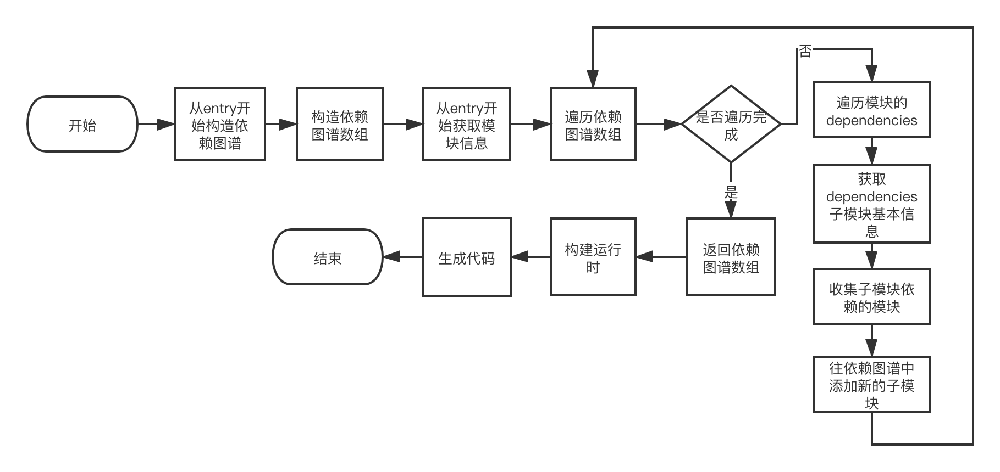

# 从minipack理解打包工具的基本原理

## 前言

前端打包工具类似`webpack`、`rollup`的使用，相信大家已经很熟悉了，但是其中的原理不知道大家有没有研究过呢，它们是如何从入口文件一步步分析依赖，打包成可以在浏览器运行的代码的；带着疑问，我们可能会马上从`源码`开始看，但是庞大`源码`可能会让人望而却步；本文将从一个迷你的打包工具[minipack](https://github.com/ronami/minipack)来简要分析打包工具的原理； 

`minipack`是由`ronami`大神编写的迷你打包工具，用来解释目前主流的一些打包工具的基本原理，里面的代码比较简易，学习起来非常简单，涉及到的建立依赖图谱相信是很多打包工具都具有的核心功能；虽然在解析循环依赖、依赖缓存方面，在代码中没有涉及，但是毕竟这只是一个入门级的打包工具，能达到学习的目的就好； 

代码中有很多英文注释，仔细阅读，会有很多收货；作者本人根据自己的理解，也对其做了一些注释，大家有兴趣可以打开我fork的[minipack](https://github.com/jackie-gan/minipack)，结合这篇文章一起食用； 

好了，下面进入正文！ 

为了能实现一些文件读取、代码分析的基本功能，`minipack`引入了以下模块去实现：
```js
// 读取文件使用
const fs = require('fs');
// 解析文件路径使用
const path = require('path');
// 进行AST解析，构造AST语法树
const babylon = require('babylon');
// 对AST语法树进行遍历
const traverse = require('babel-traverse').default;
// 将AST语法树转换为代码(字符串)
const {transformFromAst} = require('babel-core');
```

> 上文中有提到`依赖图谱`这个概念，这个概念小伙伴可以把它理解成这是一个`数据结构`，它描述了模块之间的依赖关系；

`minipack`中还提供了例子，以便于我们可以看到打包后的结果，下面在分析的时候，会结合例子一起描述。例子中提供了三个文件`entry.js`，`message.js`，`name.js`，其中`entry.js`是入口文件；

```js
// entry.js文件
import message from './message.js';

console.log(message);

// message.js文件
import {name} from './name.js';

export default `hello ${name}!`;

// name.js文件
export const name = 'world';
```

## 收集模块信息

在建立依赖图谱之前，首先要收集模块的信息，这里的信息包含：

- 模块内部的代码；
- 模块id：模块的唯一标识；
- 模块依赖列表；
- 模块对应的文件名：以便后续分析依赖的模块的时候，可以通过文件名构造完整的路径，对子模块进行读取；

`minipack`通过`createAsset`函数实现相关逻辑，在读取`js`代码后，通过`babylon`将代码转换成`AST`语法树，并且通过遍历`AST`语法树，在`ImportDeclaration`访问器中，获取`import`声明中所有的模块依赖；例如下面的`import`声明，将会被存放到`dependencies`数组中：
```js
// 分析前
import message from './message.js';
import name from './name.js';

// 分析后，存放在数组中
dependencies = ['./message.js', './name.js'];
```
在`createAsset`的过程中，模块内部代码最终也会被解析成`commonjs`模块标准的代码；

`example`中，`entry.js`在经过模块信息收集后，会构造出如下对象：

```js
{
  id: 0,
  filename: './example/entry.js',
  dependencies: [ './message.js' ],
  code: '"use strict";\n' +
    '\n' +
    'var _message = require("./message.js");\n' +
    '\n' +
    'var _message2 = _interopRequireDefault(_message);\n' +
    '\n' +
    'function _interopRequireDefault(obj) { return obj && obj.__esModule ? obj : { default: obj }; }\n' +
    '\n' +
    'console.log(_message2.default);'
}
```
这个就是`entry.js`的模块基本数据了。

## 建立依赖图谱

有了收集模块信息的功能后，就为建立依赖图谱提供了`基础数据`；`minipack`会从`入口文件`开始构造依赖图谱，并且使用数组来保存依赖图谱，具体步骤如下：

- 第一步，从`入口文件`开始构造依赖图谱，收集`入口文件`的基本数据，并且将`入口文件`作为`依赖图谱数组`的第一个元素；
- 第二步，遍历依赖图谱数组，从数组中获取模块，并遍历分析模块中的`dependencies`中的模块，收集其基本数据；在遍历过程中，创建`mapping`对象，用来保存模块中，依赖的子模块和子模块id的映射；
- 第三步，在遍历`dependencies`后，将子模块存储到依赖图谱数组中，使其成为依赖图谱中的成员；
- 第四步，直到所有的模块都被分析了，即依赖图谱数组遍历完最后一个元素，返回依赖图谱数组；

`minipack`的例子中，三个文件的依赖图谱数组，如下显示：

```js
[
  {
    id: 0,
    filename: './example/entry.js',
    dependencies: [ './message.js' ],
    code: '"use strict";\n' +
      '\n' +
      'var _message = require("./message.js");\n' +
      '\n' +
      'var _message2 = _interopRequireDefault(_message);\n' +
      '\n' +
      'function _interopRequireDefault(obj) { return obj && obj.__esModule ? obj : { default: obj }; }\n' +
      '\n' +
      'console.log(_message2.default);',
    mapping: { './message.js': 1 }
  },
  {
    id: 1,
    filename: 'example/message.js',
    dependencies: [ './name.js' ],
    code: '"use strict";\n' +
      '\n' +
      'Object.defineProperty(exports, "__esModule", {\n' +
      '  value: true\n' +
      '});\n' +
      '\n' +
      'var _name = require("./name.js");\n' +
      '\n' +
      'exports.default = "hello " + _name.name + "!";',
    mapping: { './name.js': 2 }
  },
  {
    id: 2,
    filename: 'example/name.js',
    dependencies: [],
    code: '"use strict";\n' +
      '\n' +
      'Object.defineProperty(exports, "__esModule", {\n' +
      '  value: true\n' +
      '});\n' +
      "var name = exports.name = 'world';",
    mapping: {}
  }
]
```

在`createAsset`收集的`模块数据`的基础上，新增了`mapping`对象，用来表示该模块依赖的子模块和子模块id的映射，这个`映射`在后面运行时中非常有用，以便引入子模块时，能从依赖图谱中快速定位具体的模块id； 

## 构建运行时

在实现了依赖图谱后，我们知道了我们的应用中，各个js模块是如何依赖的，那么我们怎么去运行这些模块呢？这就依赖于`打包工具`产生的`运行时(runtime)`了； 

众所周知，我们的运行环境（浏览器）不一定支持我们构建的代码的模块系统(commonjs)，这时就需要`打包工具`的运行时，去帮助模块顺利地执行模块的导入、导出和执行了； 

`minipack`采用立即执行函数构建运行时，下面就把这个立即执行函数称作runtime函数吧：

```js
(function(modules) {
  function require(id) {
    // 第一步
    const [fn, mapping] = modules[id];
    // 第二步
    function localRequire(name) {
      return require(mapping[name]);
    }
    // 第三步
    const module = { exports : {} };
    // 第四步
    fn(localRequire, module, module.exports);

    return module.exports;
  }

  require(0);
})({0: module1, 1: module2})
```

相信读过`webpack`运行时代码的同学，会觉得这段代码有点眼熟，是的，这个跟`webpack`的runtime函数很相像，实现的思想类似； 

这里的`runtime`函数，接收一个module形参，也即我们的依赖图谱，但是这里并不是依赖图谱数组，后面会讲到，依赖图谱还需要做一次转化；接着，`runtime`函数会定义一个require函数，并且调用`require(0)`，表示从`0`模块开始执行，也即入口文件； 

这里，require函数用于告诉运行时，模块应该怎么引入和导出，它接收一个模块id的形参，里面不多，主要做了四件事情：

- 第一步，根据id获取模块信息；
- 第二步，定义localRequire函数，用于提供给模块内部使用，模块内部的require调用，会根据子模块的filename，从mapping中获取id，然后继续调用require函数执行子模块；
- 第三步，构造模块将要导出的对象，并且提供给模块内部使用；
- 第四步，执行模块函数fn，返回模块导出的对象；

前面讲到，依赖图谱还需要做一次转化，是的！为了实现`模块化`，这里`runtime`构造了`函数作用域`，模块内的代码将包裹在函数内，类似入口文件最终转化后，会变成这样：

```js
{0: [
      function (require, module, exports) {
        "use strict";

        var _message = require("./message.js");

        var _message2 = _interopRequireDefault(_message);

        function _interopRequireDefault(obj) { return obj && obj.__esModule ? obj : { default: obj }; }

        console.log(_message2.default);
      },
      {"./message.js":1},
    ],
 // 其他模块这里省略
 1: [ ... ],
 ...
}
```

大家可以在项目中运行一下命令，看看结果是不是上述分析的那样：

```bash
node ./src/minipack.js
```

## 总体流程

好了，分析到这里，对于依赖分析总体的流程，大家能再复述出来吗？这里对于上述的分析，再总结一张流程图出来，加深一下印象：



## 题外话：模块重复问题

这里分享一个有趣的题外话，本文在分析中提到，`minipack`没有解决模块缓存的问题，因此，对于同一个模块，如果被两个不同的其他模块引用了，`minipack`是把这个模块打包分析两次，举个例子： 

在`examples`中，如果`entry.js`和`message.js`同时引用了`name.js`，那会怎样呢？ 

按照上面的分析，`minipack`生成两个同样的`name.js`，但是它们的模块id并不一样。

```js
// entry.js文件
import message from './message.js';
// 这里也引用了name.js
import {name} from './name.js';

console.log(message);

// message.js文件
import {name} from './name.js';

export default `hello ${name}!`;

// name.js文件
export const name = 'world';
```

这时，试一下执行`node ./src/minipack.js`命令，你会发现：

```js
{0: [
      ...省略
    ],1: [
      function (require, module, exports) {
        "use strict";

        Object.defineProperty(exports, "__esModule", {
          value: true
        });
        var name = exports.name = 'world';
      },
      {},
    ],2: [
      ...省略
    ],3: [
      function (require, module, exports) {
        "use strict";

        Object.defineProperty(exports, "__esModule", {
          value: true
        });
        var name = exports.name = 'world';
      },
      {},
    ],}
```

啊，多了一个`模块3`，而且`模块3`和`模块1`一模一样！确实如上述分析所述。

## 总结

`minipack`的代码真的很简洁，对于了解一个打包工具的基本原理真的十分有用，本篇文章抛砖引玉，如有错误，欢迎大家指正！

