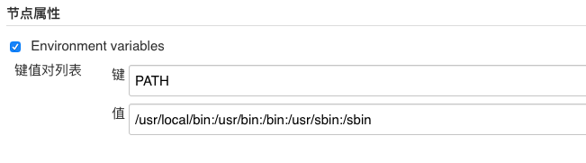

## Jenkins笔记：关于执行脚本xxx: command not found的解决

### 问题

在Jenkins任务中，执行shell脚本时，提示`xxx: command not found`的错误。

### 原因

Jenkins执行脚本时，会在节点机器上，创建类似`jenkins13673834941192920562.sh`的临时文件，然后执行默认的命令：

```shell
/bin/sh -xe /var/folders/rb/j_5nsgj13sl3zghg8jqjb9g40000gn/T/jenkins13673834941192920562.sh
```

如果脚本头写明参数：

```shell
#!/bin/bash -x

...
```

则会执行

```shell
/bin/sh -x /var/folders/rb/j_5nsgj13sl3zghg8jqjb9g40000gn/T/jenkins13673834941192920562.sh
```

这种方式属于`非交互+非登陆式`执行`shell`脚本，执行脚本时，无法获取环境中的变量，所有找不到`xxx`的命令，就提示`xxx: command not found`；


### 解决方法1：

通过配置环境变量的方式

- 1、查看主机的环境变量

```shell
echo $PATH
```
- 2、把服务器的环境变量添加到Jenkins，在`Manage Jenkins > Manage Nodes and Clouds`中设置`节点属性 > Environment variables > 键值对列表`；



### 解决方法2：

首先了解一下集中shell脚本的区别，下面参考自[文章](https://my.oschina.net/mrpei123/blog/1821380)：

- 1、交互式shell（interactive shell）和非交互式shell（non-interactive shell）

交互式的shell会有一个输入提示符，并且它的标准输入、输出和错误输出都会显示在控制台上。这种模式也是大多数用户非常熟悉的：登录、执行一些命令、退出。当你退出后，shell也终止了。 

非交互式shell是bash script.sh这类的shell。在这种模式下，shell不与你进行交互，而是读取存放在文件中的命令,并且执行它们。当它读到文件的结尾EOF，shell也就终止了。 

- 2、登录式shell（login shell）和非登陆式shell（no-login shell）

需要输入用户名和密码的shell就是登陆式shell。因此通常不管以何种方式登陆机器后用户获得的第一个shell就是login shell。不输入密码的ssh是公钥打通的，某种意义上说也是输入密码的。 

非登陆式的就是在登陆后启动bash等，即不是远程登陆到主机这种。 


- 对于常用环境变量设置文件，整理出如下加载情况表：

| 文件 | 非交互+登陆式 | 交互+登陆式 | 交互+非登陆式 | 非交互+非登陆式 |
|:-:|:-:|:-:|:-:|:-:|
| /etc/profile | 加载 | 加载 |  |  |
| /etc/bashrc | 加载 | 加载 |  |  |
| ~/.bash_profile | 加载 | 加载 |  |  |
| ~/.bashrc | 加载 | 加载 | 加载 |  |
| BASH_ENV |  |  |  | 加载 |

执行脚本，如`bash script.sh`是属于`非交互+非登陆式`；

> 所以Jenkin任务执行脚本也是属于`非交互+非登陆式`； 

在Jenkins任务配置中，需要`Execute Shell`脚本前添加`-i参数和-l参数`， 让bash为login shell and interactive shell，这样就可以读取`/etc/profile和~/.bash_profile`等文件；

```shell
#!/bin/bash -ilex

eche '你的脚本'
```

另外需要说明一下这里用到的一些`sh`命令的参数：

| 参数 | 说明 |
|:-:|:-:|
| -i | 让bash为interactive shell |
| -l | 让bash为login shell |
| -e | 当命令退出并且返回一个非0的状态时，立即退出 |
| -x | 当命令被执行时，打印命令和命令的参数 |
