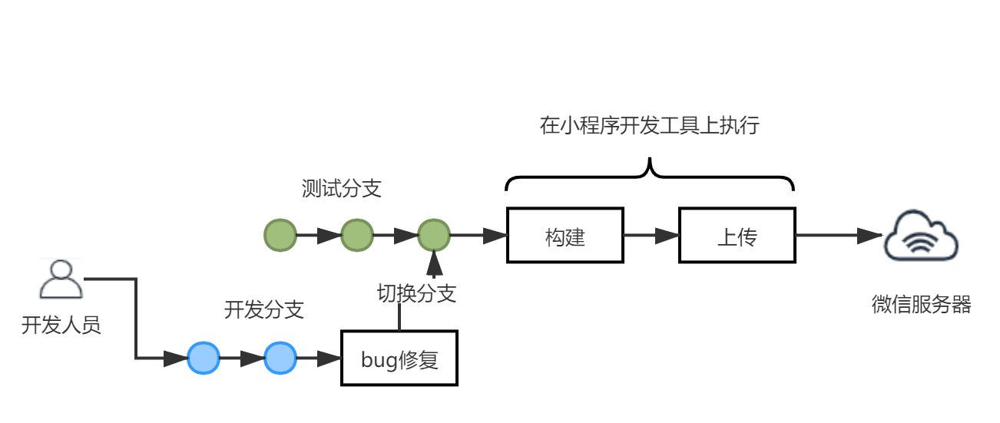

# Jenkins实现微信小程序持续部署

## 痛点？

自动化一直是我们前端工程化的一个重要方向，前端工程从构建到部署，以自动化脚本执行替代人工操作，不仅能更好地减少中间流程出现的误操作，还能使得开发从重复性的劳动中解放出来； 

小程序开发受限于平台的开发工具，我们在开发的过程中，编译以及部署（上传代码）小程序代码，都需要通过可视化的开发工具，所以H5开发中使用的持续部署流程，并不适用于小程序开发流程；这就使得我们在开发小程序的过程中，构建和发布代码到测试和线上环境，往往需要通过开发的手动操作，万一出现手工误操作，就会阻断测试流程或者出现生产事故了；设想一下以下场景：

- 场景：一个小程序工程往往涉及到多个分支并行开发，每个分支对应着不同的需求或特性，在版本迭代的过程中，每个分支对应上线时间可能不一样；在一个分支正在测试阶段，另一个分支正在开发阶段的情况下，测试找你去修复测试分支的bug，这个时候，你就需要切换到测试分支去修复问题，重新构建和上传代码，提供测试一个新的二维码，然后再回到新的开发分支继续开发；一旦出现新的bug，你又要重复上述工作；



在这个过程中，构建和部署代码的重复性劳动，大大降低了开发的效率；解决这个痛点，将能提升效率；

## 解决思路

我们知道，H5持续发布的大致流程可以是由`Jenkins`触发构建脚本，构建脚本运行生成目标代码的`dist`文件夹，再通过脚本将`dist`文件夹上传至部署的服务器目录中（此处简化描述了，实际流程可能会更加复杂）；这里注意到了构建和上传的动作都是由脚本执行的，而一般的脚本会使用bash来实现：

```bash
git clone xxx
git checkout target_branch
npm install
npm run build
tar dist
```

执行完脚本后，由Jenkins通过ssh将文件上传到部署的服务器目录中； 

> 那么问题来了，小程序的持续发布是否可以参照呢？这里需要解决的是小程序的构建和上传是否也能实现相关的脚本；

答案是可以的，微信小程序开发工具在新的版本中，推出了`命令行调用`和`http调用`两种方式，使得构建和上传的流程不在拘泥于开发工具的可视化界面；这也意味着，我们也可以编写bash脚本，在Jenkins中自动化执行这些流程； 

好，现在就一起来实践一下！

## 命令行和http调用

在新版本的微信开发者工具中，提供了[命令行调用](https://developers.weixin.qq.com/miniprogram/dev/devtools/cli.html)和[http调用](https://developers.weixin.qq.com/miniprogram/dev/devtools/http.html)两种方式进行登录、预览、上传等操作，具体使用方式可以直接参照官方文档； 

> 需要注意的是，这两种调用都需要在微信开发工具的`设置 > 通用设置 > 安全`中开启服务端口。

二者有什么区别呢：

- `命令行调用`的方式，允许在当前机器上，通过命令行工具或者`shell`脚本对微信小程序中的命令进行调用；
- 而`http调用`的方式，允许远程调用----------------------------------》 待验证

## Jenkins配置

在使用Jenkins构建部署上，存在多种方式；你可以直接在你的Jenkins服务器的机器上完成部署，但是由于小程序的`命令行和http调用`只提供`Mac`和`Windows`两种方式，所以这就意味着Jenkins服务也需要在对应的操作系统上；不过，Jenkins的服务也有可能会部署在`Linux`系统上，而`Linux`上不支持小程序的`命令行和http调用`，因此，在这种情况下，就有必要将Jenkins服务和小程序的构建服务进行分离。 

### 实现Master/Slave主从模式

正好，Jenkins支持`Master/Slave`模式，在这种模式下，Jenkins服务可以部署在`Linux`服务器上，作为Master机器；而小程序的构建机器可以作为Jenkins服务器的Slave节点，专门运行由Master机器触发的小程序构建任务； 

这里选择一台`Mac`机器作为小程序的构建机器，将这台机器配置为Slave节点时，需要在Jenkins按照如下步骤配置：

- 在`Manage Jenkins > Manage Nodes and Clouds`中选择新建节点；
- 新建节点时，选择`Permanant Agent`，然后开始配置节点信息；
- 配置节点信息时，`远程工作目录`是指在Mac上运行jenkins的工作目录，需要自己手动创建一个目录，这样后面git拉到的代码会自动放到该目录下，这里一定要注意权限，文件目录设为可读可写，要不然后面jenkins启动时候会遇到权限问题；
- `用法`选择`Only build jobs with label expressions matching this node`，确保只有Jenkins任务中声明的Label匹配，才能使用该Slave节点；
- `启动方式`选择`Launch agents via SSH`，Credentials配置时，按照Slave机器的用户名和密码填写即可；
- 配置完节点信息后，记得需要在Slave节点的`Mac`机器上，创建对应的`远程工作目录`，否则会构建时会提示找不到对应目录；
- 最后，记得开启Slave节点`Mac`机器上的远程登录权限，否则无法通过`SSH`进行连接；
- 成功后，会看到构建的节点多了一个`mac_node`，但此时，节点会处于`未连接`的状态，需要打开节点，再选择`Launch agent`进行启动；


### 构建任务的创建


## 脚本的实现

## 测试

## 总结


