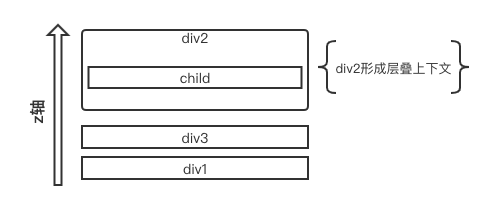
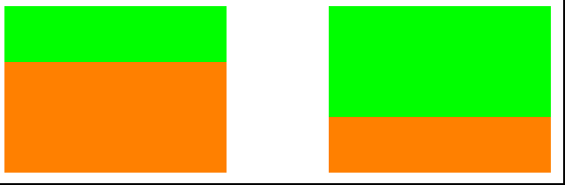
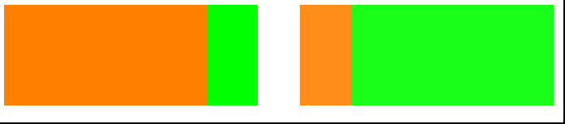

# 从一个现象出发理解CSS层叠上下文

## 现象

在实现`Loading`组件的时候，不知道大家有没有遇到下面的问题：

- 首先看看正常的情况：


- 如果试着在这个`Loading`组件下面的图片加上样式`position: relative; z-index: 1`，就会出现下面的情况：


> 这里的`Loading`组件是使用`opacity`以及`transition`去实现的（参考了[Taro](https://taro.js.org/)的实现），上述实现的具体代码可以从[这里]()查看；

`Loading`框的显示通过设置`opacity从0到1`的转换，中间通过`transtition`实现渐变的效果； 

```html
// opacity从0到1转换，transtition实现渐变
<div id="toast" style="opacity: 0; transition: opacity 0.5s linear 0s;">
  <div class="mask"></div>
  <div class="loading">
    ...省略代码
  </div>
</div>
```

可以发现当页面中存在其他的定位元素时，`Loading`框就有一部分显示异常，异常表现为`opacity小于1`时，被**遮挡**，`opacity等于1`时，才**完全展示**；

## 本质

如果要修复这个问题，其实有多种方法：

- 比如说，通过移除定位元素的样式，比如上述情况可以去掉图片的样式`position: relative; z-index: 1`；但是显然，这是不可取的，治标不治本；

- 或者修改`Loading`框的样式，比如说去掉`tansition`的渐变样式，但是这种方式导致`Loading`框的出现，失去了渐变的效果；

要想出一种比较好的解决方案，需要`看清现象的本质`； 

其实导致这种问题的原因，是因为`opacity`的css属性使得元素产生了`层叠上下文`；在[MDN的文档](https://developer.mozilla.org/en-US/docs/Web/CSS/CSS_Positioning/Understanding_z_index/The_stacking_context)里面有提到，在某些场景下是会产生层叠上下文，其中`opacity小于1`时，也会产生； 

在产生层叠上下文的dom节点中，其内部的层叠顺序，不会影响到外部的元素； 

所以在展示这个`Loading`组件的过程中，由于其`opacity`是逐渐从`0转换到1`的，所以：

- 当`opacity小于1`时，id为`toast`的`div`内形成层叠上下文，内部`loading`的样式不会影响到外部的元素，所以`z-index为1`的`img-wrap`会覆盖`Loading`组件；

- 当`opacity大于1`时，id为`toast`的`div`不形成层叠上下文，所以`z-index为1`的`img-wrap`会被`Loading`组件的`z-index:5000`覆盖；

```html
<style>
  .loading {
    z-index: 5000;
    position: fixed;
    top: 30%;
    left: 50%;
  }
</style>
<div class="wrapper">
  <div class="img-wrap" style="position: relative; z-index: 1;">
    
  </div>
</div>
<div id="toast" style="opacity: 0; transition: opacity 0.5s linear 0s;">
  <div class="mask"></div>
  <div class="loading">
    ...省略代码
  </div>
</div>
```

了解了这个问题的本质是由于`层叠上下文`引起的，那首先我们要先掌握`层叠上下文`的原理，然后才能针对这个现象给出更好地解决方案；

## 什么是CSS层叠上下文

在引出`层叠上下文`概念之前，首先需要说明的是，HTML中的每个元素的位置都存在三维的概念，即存在x,y,z轴的位置数值表示元素的位置；其中z轴方向上的HTML元素是存在层叠关系的，元素会按照一定优先级进行渲染；这里，在z轴方向的元素层叠顺序优先级就是基于`层叠上下文(stacking context)`这个概念实现的；

跟`BFC`一样，这个概念第一次看`层叠上下文`也是感觉比较抽象，在[张鑫旭大神的文章](https://www.zhangxinxu.com/wordpress/2016/01/understand-css-stacking-context-order-z-index/)中，用了`官员`来比喻`层叠上下文`，不同等级的`官员`来比喻`层叠水平`，这对理解概念更加容易了； 

在本文中，我将使用自己的另外一个比喻来重新解释`层叠上下文`，前面提到，层叠顺序是基于`层叠上下文`的，元素在同一个`层叠上下文`中按照`层叠顺序`的规则进行排序，那么，`层叠上下文`可以比喻成一个`装有卡片的盒子`，在盒子中的`卡片`，按照一定的`层叠规则`进行排序； 

例如，如下的HTML代码中，各个元素之间的层叠关系可以直观表示为：

```html
<div class="wrapper">
  <div class="div1">div1</div>
  <div class="div2" style="position: fixed: z-index: 1">
    <div class="child">child</div>
  </div>
  <div class="div3">div3</div>
</div>
```



## 层叠顺序和层叠水平

那么，对于同一个层叠上下文内，元素的层叠顺序是怎样的呢？在描述`层叠顺序`之前，首先介绍一下层叠水平：

> 参考css规范中的[描述](https://www.w3.org/TR/CSS22/visuren.html#z-index)：在同一个层叠上下文中，每一个元素都具有一个`层叠水平(stacking level)`，层叠水平使用`整型`来表示，可以为负值，它描述着在当前层叠上下文中，该元素相对于其他元素在z轴上的位置，层叠水平高的元素总是布局在层叠水平低的元素前面，也就是`谁大谁上`原则，拥有相同的层叠水平的元素，将按照DOM流中的顺序进行布局，也就是`后来者居上`的原则；

> 需要注意的是，层叠水平和CSS的z-index不能混为一谈。z-index影响层叠水平只限于定位元素以及flex盒子的孩子元素；而层叠水平所有的元素都存在。

`层叠顺序(stacking order)`表示元素在层叠时的一个垂直堆叠顺序；前文提到的`层叠上下文`和`层叠水平`其实都是概念，而`层叠顺序`是具体的规则；在每一个层叠上下文中，元素将按照下面的顺序`(1为最低层，7为最高层)`进行层叠：

- Layer 1、产生层叠上下文的元素的`background`和`border`；
- Layer 2、层叠水平为负值的后代层叠上下文；
- Layer 3、常规流中，非行内(inline)、非定位的子元素；
- Layer 4、非定位浮动子元素；
- Layer 5、常规流中，行内(inline)、非定位的子元素，包括行内`table`(inline-table)和行内块(inline-block)；
- Layer 6、层叠水平为0的后代层叠上下文以及层叠水平为0`(z-index为0或auto)`的定位子元素；
- Layer 7、层叠水平为正值的后代层叠上下文；


> 在Layer 6中，可以解释为什么一旦普通元素具有了层叠上下文，其层叠顺序就会变高；因为元素具有层叠上下文后，如果它不是定位元素，那么它就属于`层叠水平为0的后代层叠上下文`；

## 如何产生层叠上下文

满足以下条件中任意一个的元素都会自动创建一个层叠上下文（参考自[MDN](https://developer.mozilla.org/zh-CN/docs/Web/Guide/CSS/Understanding_z_index/The_stacking_context)）：

- 文档根元素（`<html>`）；
- position 值为 absolute（绝对定位）或  relative（相对定位）且 z-index 值不为 auto 的元素；
- position 值为 fixed（固定定位）或 sticky（粘滞定位）的元素；
- flex (flexbox) 容器的子元素，且 z-index 值不为 auto；
- grid (grid) 容器的子元素，且 z-index 值不为 auto；
- opacity 属性值小于 1 的元素；
- mix-blend-mode 属性值不为 normal 的元素；
- 以下任意属性值不为 none 的元素：`transform`，`filter`，`perspective`，`clip-path`，`mask / mask-image / mask-border`；
- isolation 属性值为 isolate 的元素；
- -webkit-overflow-scrolling 属性值为 touch 的元素；
- will-change 值设定了任一属性而该属性在 non-initial 值时会创建层叠上下文的元素；
- contain 属性值为 layout、paint 或包含它们其中之一的合成值（比如 contain: strict、contain: content）的元素。

## 一些例子

这里我摘选两个我认为比较重要的点，进行举例说明：

- 具有层叠上下文的元素，比一般的元素的层叠水平要高

```html
<style>
.div1 {
    height: 100px;
    width: 200px;
    background-color: #00ff00;
    /* filter: blur(0px); */
}
.div2 {
    height: 100px;
    width: 200px;
    margin-top: -50px;
    background-color: #ff8000;
}
</style>
<div class="div1"></div>
<div class="div2"></div>
```

正常情况下，`div1`和`div2`没有形成层叠上下文，二者根据`后来者居上`的原则，`div2`会覆盖在`div1`上方，如下图左边所示；当`div1`加上`filter: blur(0px);`的css属性，此时`div1`满足产生层叠上下文的条件，层叠水平比一般的元素要高，如下图右边所示； 



- 当不同层叠顺序的元素相比较时，不关心元素在DOM中的层级关系

```html
<style>
.parent {
  height: 100px;
  width: 200px;
  background-color: #ff8000;
}

.child {
  height: 100px;
  width: 200px;
  position: relative;
  z-index: -1;
  background-color: #00ff00;
  margin-left: 50px;
}
</style>
<div class="parent">
  <div class="child"></div>
</div>
<div class="parent" style="opacity: 0.9;">
  <div class="child"></div>
</div>
```

`parent`元素没有产生层叠上下文，所以`parent`和`child`元素是在同一个层叠上下文中的，所以根据层叠顺序，`child`属于`层叠水平为负值的后代层叠上下文`，而`parent`属于`常规流中，非行内(inline)、非定位的子元素`，因此`parent`应该在`child`之上，如下图左边所示； 

当`parent`添加了`opacity: 0.9`属性后，形成了层叠上下文，`child`在这个层叠上下文当中，根据层叠顺序，它要比产生层叠上下文的元素的水平要高，因此`child`在`parent`之上，如下图右边所示；



## 回到最初的问题

了解了层叠上下文的一些规律之后，重新回到最开始的问题，如何更好的解决`Loading`组件中`opacity`的css属性使得元素产生了`层叠上下文`；

```html
// opacity从0到1转换，transtition实现渐变
<div id="toast" style="opacity: 0; transition: opacity 0.5s linear 0s;">
  <div class="mask"></div>
  <div class="loading">
    ...省略代码
  </div>
</div>
```

我认为，既然`toast`节点已经产生了层叠上下文，而`loading`节点也有`position: fixed; z-index: 5000;`的css属性，`Loading`组件的最终目的是，使得组件层级位于较高的水平，所以不妨提高`toast`节点的层叠水平，修改后如下：

```html
// opacity从0到1转换，transtition实现渐变
<div id="toast" style="opacity: 0; transition: opacity 0.5s linear 0s; position: fixed; z-index: 5000;">
  <div class="mask"></div>
  <div class="loading">
    ...省略代码
  </div>
</div>
```

## 结语

通过上述案例和分析，了解到元素间的层叠关系，不仅仅是通过`z-index`控制，层叠上下文和层叠顺序的规则也会导致元素的堆叠产生变化，巧用规则以及了解层叠上下文的原理，有利于我们更好维护页面中元素的层级关系； 

本文是站在巨人的肩膀上，根据自己的理解，自己遇到的问题进行总结的，欢迎大家批评指正； 

## Reference

- [深入理解CSS中的层叠上下文和层叠顺序](https://www.zhangxinxu.com/wordpress/2016/01/understand-css-stacking-context-order-z-index/)
- [CSS层叠顺序探究](https://aotu.io/notes/2015/11/08/css-stack-order/index.html)
- [MDN关于层叠上下文的文档](https://developer.mozilla.org/zh-CN/docs/Web/Guide/CSS/Understanding_z_index/The_stacking_context)
- [css规范](https://www.w3.org/TR/CSS22/visuren.html#z-index)