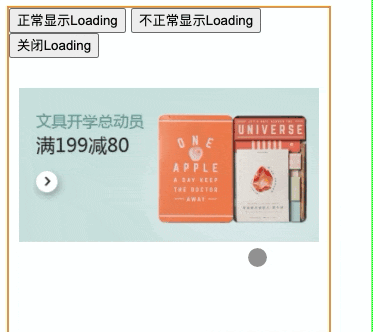
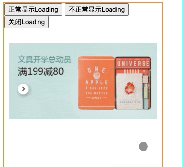

# 从一个现象出发理解CSS层叠上下文

## 现象

在实现`Loading`组件的时候，不知道大家有没有遇到下面的问题：

- 首先看看正常的情况：



- 如果试着在这个`Loading`组件下面的图片加上样式`position: relative; z-index: 1`，就会出现下面的情况：



> 这里的`Loading`组件是使用`opacity`以及`transition`去实现的（参考了[Taro](https://taro.js.org/)的实现），上述实现的具体代码可以从[这里]()查看；

`Loading`框的显示通过设置`opacity从0到1`的转换，中间通过`transtition`实现渐变的效果； 

```html
// opacity从0到1转换，transtition实现渐变
<div id="toast" style="opacity: 0; transition: opacity 0.5s linear 0s;">
  <div class="mask"></div>
  <div class="loading">
    ...省略代码
  </div>
</div>
```

可以发现当页面中存在其他的定位元素时，`Loading`框就有一部分显示异常，异常表现为`opacity小于1`时，被**遮挡**，`opacity等于1`时，才**完全展示**；

## 本质

如果要修复这个问题，其实有多种方法：

- 比如说，通过移除定位元素的样式，比如上述情况可以去掉图片的样式`position: relative; z-index: 1`；但是显然，这是不可取的，治标不治本；

- 或者修改`Loading`框的样式，比如说去掉`tansition`的渐变样式，但是这种方式导致`Loading`框的出现，失去了渐变的效果；

要想出一种比较好的解决方案，需要`看清现象的本质`； 

其实导致这种问题的原因，是因为`opacity`的css属性使得元素产生了`层叠上下文`；在[MDN的文档](https://developer.mozilla.org/en-US/docs/Web/CSS/CSS_Positioning/Understanding_z_index/The_stacking_context)里面有提到，在某些场景下是会产生层叠上下文，其中`opacity小于1`时，也会产生； 

在产生层叠上下文的dom节点中，其内部的层叠顺序，不会影响到外部的元素； 

所以在展示这个`Loading`组件的过程中，由于其`opacity`是逐渐从`0转换到1`的，所以：

- 当`opacity小于1`时，id为`toast`的`div`内形成层叠上下文，内部`loading`的样式不会影响到外部的元素，所以`z-index为1`的`img-wrap`会覆盖`Loading`组件；

- 当`opacity大于1`时，id为`toast`的`div`不形成层叠上下文，所以`z-index为1`的`img-wrap`会被`Loading`组件的`z-index:5000`覆盖；

```html
<style>
  .loading {
    z-index: 5000;
    position: fixed;
    top: 30%;
    left: 50%;
  }
</style>
<div class="wrapper">
  <div class="img-wrap" style="position: relative; z-index: 1;">
    
  </div>
</div>
<div id="toast" style="opacity: 0; transition: opacity 0.5s linear 0s;">
  <div class="mask"></div>
  <div class="loading">
    ...省略代码
  </div>
</div>
```

了解了出发这个问题的本质是由于`层叠上下文`引起的，那首先我们要先掌握`层叠上下文`，然后才能针对这个现象给出更好地解决方案；

## CSS层叠上下文

在引出`层叠上下文`概念之前，首先需要说明的是，在

跟`BFC`一样，这个概念第一次看`层叠上下文`也是感觉比较抽象，在[张鑫旭大神的文章](https://www.zhangxinxu.com/wordpress/2016/01/understand-css-stacking-context-order-z-index/)中，用了`官员`来比喻`层叠上下文`，不同等级的`官员`来比喻`层叠水平`，这对理解概念更加容易了； 

这里，我使用自己的另外一个比喻来重新理解`层叠上下文`，如果把

> A stacking context is formed, anywhere in the document, by any element in the following scenarios:
>
> - Root element of the document.
> - Element with a position value absolute or relative and z-index value other than auto.
> - Element with a position value fixed or sticky (sticky for all mobile browsers, but not older desktop).
> - Element that is a child of a flex (flexbox) container, with z-index value other than auto.
> - Element that is a child of a grid (grid) container, with z-index value other than auto.
> - Element with a opacity value less than 1 (See the specification for opacity).
> - Element with a mix-blend-mode value other than normal.
> - Element with any of the following properties with value other than none: `transform`,`filter`,`perspective`,`clip-path`,`mask / mask-image / mask-border`.
> - Element with a isolation value isolate.
> - Element with a -webkit-overflow-scrolling value touch.
> - Element with a will-change value specifying any property that would create a stacking context on non-initial value (see this post).
> - Element with a contain value of layout, or paint, or a composite value that includes either of them (i.e. contain: strict, contain: content).

## 层叠水平

## 层叠顺序

## 例子

## 结语