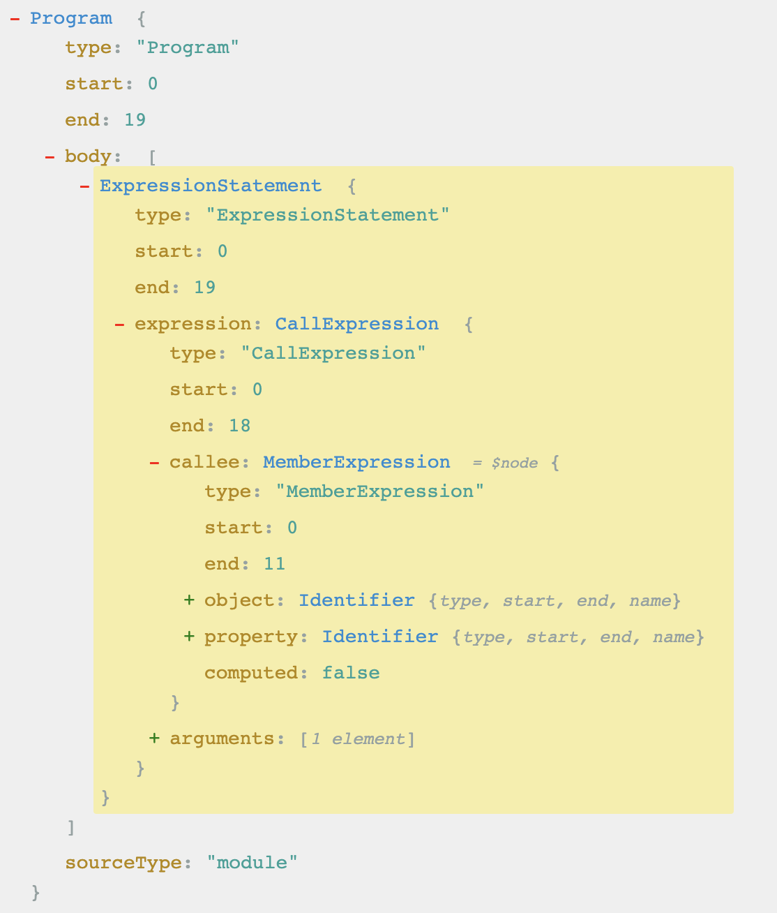

# 用JS来解释JS：简易实现JS解释器

## 前言

说到`编译原理`，对于一个小前端来说，既远又近，远是因为如果单单进行业务开发，你可能基本不需要接触到它；但是当你想往深处进阶时，你就会发现，现在前端的世界里，到处都是`编译原理`的应用，而且这些应用其实离你非常近，比如日常用到的`webpack`、`rollup`、`babel`甚至`postcss`，最近的多端打包框架`Taro`和`mpvue`也离不开`编译原理`的应用； 

回想起大学时候的`编译原理`课程以及书籍，十分晦涩难懂，工作后，如果工作内容与编译原理脱节的话，难免会越来越生疏；但是如果想要技术更上一层楼，作为计算机基础学科之一的`编译原理`，是必须要掌握的； 

本人在使用`babel`对代码进行优化的过程中，慢慢地对`编译原理`有进一步地认识，在前人的启发下（[JSJS](https://github.com/bramblex/jsjs)），尝试实现一个JS解释器，用JS来解释JS； 

> 先声明：编译原理远远不止本文讲的内容，其还有很多内容是本文没有提及的。

> 仓库地址：https://github.com/jackie-gan/tiny-js-interpreter

## 准备工作

首先何为JS解释器？简单来说，就是使用JS来运行JS； 

既然需要用JS来运行JS，那么就需要做到读懂JS，以及主动执行JS； 

例如，如何执行`console.log('123');`的语句呢：

- 首先需要解释JS语句中的各个单词`console`、`log`、`'123'`；
- 然后找到它们是属于什么语法，例如`console.log('123');`其实属于一个`CallExpression`，`callee`是一个`MemberExpression`；
- 最后找到`MemberExpression`中的`console`对象，再找到它的`log`函数，最后执行函数，输出`123`；

所以为了达到读懂和执行JS，就需要用到以下工具：

- [acorn](https://github.com/acornjs/acorn)，代码解析的工具，能把JS代码转换成对应的AST语法树；
- [astexplorer](https://astexplorer.net/)，直观地查看AST语法树；

## 实现思路

- 第一步，由`acorn`将代码转换成`AST`语法树；
- 第二步，自定义遍历器以及节点处理函数；
- 第三步，在处理函数中，执行目标代码，并递归执行；
- 第四步，解释器入口函数先处理第一个`AST`节点；

## 遍历器实现

由`acorn`转换的`AST`语法树符合[ESTree](https://github.com/estree/estree)规范，例如通过`astexplorer`查看`console.log('123');`语句转换后的`AST`语法树，它是这样的：



可以看到，语法树上有不同的节点类型，因此，需要继续定义好每个节点的处理函数：

```js
const es5 = {
  Program() {},
  ExpressionStatement() {},
  BlockStatement() {},
  ThisExpression() {},
  ObjectExpression() {},
  BinaryExpression() {},
  Literal() {},
  Identifier() {},
  VariableDeclaration() {},
  ...
};
```

接下来，就需要实现一个遍历器，用于`依次递归遍历`语法树的节点，以达到最终把语法树遍历完：

```js
const vistorsMap = {
  ...es5
};

export function evaluate(astPath: AstPath<ESTree.Node>) {
  const visitor = vistorsMap[astPath.node.type];

  return visitor(astPath);
}
```

## 节点处理函数

对`AST`语法树节点的处理就好像对`DOM`树的节点处理一样，遍历到节点后，对节点按照规范处理即可； 

本文目前只实现了`es5`规范的代码解释，所以处理的节点主要是以`es5`的节点为主，下面就举例部分节点的处理方法：

### Program节点

作为整个`AST`语法树的根节点，只需要依次遍历节点的`body`属性，`body`中节点顺序就是JS语句的执行顺序；

```js
Program: (astPath: AstPath<ESTree.Program>) => {
  const { node, scope, evaluate } = astPath; 
  node.body.forEach((bodyNode) => {
    evaluate({ node: bodyNode, scope, evaluate });
  });
},
```

### BinaryExpression节点

处理二元运算表达式节点，需要首先将`left`和`right`两个表达式，然后根据`operator`执行相应的计算，最后返回处理结果。

```js
BinaryExpression: (astPath: AstPath<ESTree.BinaryExpression>) => {
  const { node, scope, evaluate } = astPath;
  const leftVal = evaluate({ node: node.left, scope, evaluate });
  const rightVal = evaluate({ node: node.right, scope, evaluate });
  const operator = node.operator;

  const calculateFunc = {
    '+': (l, r) => l + r,
    '-': (l, r) => l - r,
    '*': (l, r) => l * r,
    '/': (l, r) => l / r,
    '%': (l, r) => l % r,
    '<': (l, r) => l < r,
    '>': (l, r) => l > r,
    '<=': (l, r) => l <= r,
    '>=': (l, r) => l >= r,
    '==': (l, r) => l == r,
    '===': (l, r) => l === r,
    '!=': (l, r) => l != r,
    '!==': (l, r) => l !== r
  };

  if (calculateFunc[operator]) return calculateFunc[operator](leftVal, rightVal);
  else throw `${TAG} unknow operator: ${operator}`;
}
```

### WhileStatement节点

`While`循环的节点包含`test`、`body`属性；`test`属性是while循环的条件，所以需要继续递归遍历，而`body`表示while循环内的逻辑，也需要继续递归遍历； 

```js
WhileStatement: (astPath: AstPath<ESTree.WhileStatement>) => {
  const { node, scope, evaluate } = astPath;
  const { test, body } = node;

  while (evaluate({ node: test, scope, evaluate })) {
    const result = evaluate({ node: body, scope, evaluate });

    if (Signal.isBreak(result)) break;
    if (Signal.isContinue(result)) continue;
    if (Signal.isReturn(result)) return result.result;
  }
}
```

这里需要额外注意的是，在`While`循环中，可能会遇到`break`，`continue`或者`return`的关键字终止循环逻辑；所以需要对这些关键字进行额外处理；

### 关键字处理

`break`，`continue`、`return`也有对应的节点类型`BreakStatement`、`ContinueStatement`、`ReturnStatement`；我们需要另外定义一个关键字基类`Signal`，它的实例作为这些关键字节点类型函数的返回值，以便它们的上一级能处理；

```js
BreakStatement: () => {
  // 返回结果到上一级
  return new Signal('break');
}

ContinueStatement: () => {
  // 返回结果到上一级
  return new Signal('continue');
}

ReturnStatement: (astPath: AstPath<ESTree.ReturnStatement>) => {
  const { node, scope, evaluate } = astPath;
  // 返回结果到上一级
  return new Signal('return', node.argument ? evaluate({ node: node.argument, scope, evaluate }) : undefined);
}
```

`Signal`基类如下：

```js
type SignalType = 'break' | 'continue' | 'return';

export class Signal {
  public type: SignalType
  public value?: any

  constructor(type: SignalType, value?: any) {
    this.type = type;
    this.value = value;
  }

  private static check(v, t): boolean {
    return v instanceof Signal && v.type === t;
  }

  public static isContinue(v): boolean {
    return this.check(v, 'continue');
  }

  public static isBreak(v): boolean {
    return this.check(v, 'break');
  }

  public static isReturn(v): boolean {
    return this.check(v, 'return');
  }
}
```

### 更多节点处理

因为`AST`节点类型太多了，会本文篇幅太长，需要看其他节点的处理的话，可以直接到[Git仓库](https://github.com/jackie-gan/tiny-js-interpreter)查看； 

在处理到`VariableDeclaration`节点的时候，也就是变量声明时，就发现一个问题了：定义的变量应该保存在哪里呢？ 

这个时候就需要引入`作用域`的概念了；

## 作用域

我们都知道，`JS`有`全局作用域`、`函数作用域`、`块级作用域`的概念； 

在`全局上下文`中定义的变量，应该保存在`全局上下文`中，而在`函数上下文`中定义的变量，应该保存在`函数作用域`中； 

```js
export class Scope {
  private parent: Scope | null;
  private content: { [key: string]: Var };
  public invasive: boolean;

  constructor(public readonly type: ScopeType, parent?: Scope) {
    this.parent = parent || null;
    this.content = {};  // 当前作用域的变量
  }

  /**
   * 存储到上一级的作用域中 
   */
  public var(rawName: string, value: any): boolean {
    let scope: Scope = this;

    // function定义在函数作用域内
    while (scope.parent !== null && scope.type !== 'function') {
      scope = scope.parent;
    }

    scope.content[rawName] = new Var('var', value);
    return true;
  }

  /**
   * 只在当前作用域定义
   */
  public const(rawName: string, value: any): boolean {
    if (!this.content.hasOwnProperty(rawName)) {
      this.content[rawName] = new Var('const', value);
      return true;
    } else {
      // 已经定义了
      return false;
    }
  }

  /**
   * 
   */
  public let(rawName: string, value: any): boolean {
    if (!this.content.hasOwnProperty(rawName)) {
      this.content[rawName] = new Var('let', value);
      return true;
    } else {
      // 已经定义了
      return false;
    }
  }

  /**
   * 从作用域上查找变量
   */
  public search(rawName: string): Var | null {
    // 1.先从当前作用域查找
    if (this.content.hasOwnProperty(rawName)) {
      return this.content[rawName];
    // 2.如果没有，则继续往上级查找
    } else if (this.parent) {
      return this.parent.search(rawName);
    } else {
      return null;
    }
  }

  public declare(kind: KindType, rawName: string, value: any): boolean {
    return ({
      'var': () => this.var(rawName, value),
      'const': () => this.const(rawName, value),
      'let': () => this.let(rawName, value)
    })[kind]();
  }
}
```

当遇到`BlockStatement`时，就需要形成一个`Scope`实例，因为类似`const`和`let`定义的变量，会形成`块级作用域`，它们的值会保存在当前`块级作用域`中； 

而此时，`BlockStatement`中的`var`变量依然需要定义在上一级的作用域中，直到遇到`函数作用域`，因此，在定义`var`时，会有如下的处理：

```js
public var(rawName: string, value: any): boolean {
  let scope: Scope = this;

  // 把变量定义到父级作用域
  while (scope.parent !== null && scope.type !== 'function') {
    scope = scope.parent;
  }

  scope.content[rawName] = new Var('var', value);
  return true;
}
```

## 入口函数

到此，已经具备了读懂JS和执行JS的能力了，下面就定义一个入口函数，并且把执行结果进行输出：

```js
export function execute(code: string, externalApis: any = {}) {
  // 全局作用域
  const scope = new Scope('root');
  scope.const('this', null);

  for (const name of Object.getOwnPropertyNames(defaultApis)) {
    scope.const(name, defaultApis[name]);
  }

  for (const name of Object.getOwnPropertyNames(externalApis)) {
    scope.const(name, externalApis[name]);
  }

  // 模块导出
  const $exports = {};
  const $module = { exports: $exports };
  scope.const('module', $module);
  scope.var('exports', $exports);

  const rootNode = acorn.parse(code, {
    sourceType: 'script'
  });

  const astPath: AstPath<ESTree.Node> = {
    node: rootNode,
    evaluate,
    scope
  }

  evaluate(astPath);

  // 导出结果
  const moduleExport = scope.search('module');

  return moduleExport ? moduleExport.getVal().exports : null;
}
```

入口函数`execute`接收两个参数：

- code为转换为字符串后的代码；
- externalApis为一些`“内置”`对象；

入口函数的结果输出，通过自定义的`module.exports`对象实现；

## 目前能做什么

目前这个解释器只是一个雏形，它目前只能做一些简单的JS解释：

- 例如跑通所写的测试用例；
- 在类似小程序的环境中做一些简单地代码执行；

如果把打包完后的js，放到小程序中运行，它的运行效果如下：

- 样例代码：

```js
const interpreter = require('./interpreter');

// 实例一：
interpreter.execute(`
  wx.showModal({
    title: '实例一',
    success: function() {
      wx.showToast({
        title: '点击按钮啦'
      });
    }
  });
`, { wx: wx });

// 实例二：
interpreter.execute(`
  setTimeout(function() {
    wx.showToast({
      title: '倒计时完成'
    });
  }, 1000);
`, { wx: wx });

```

- 效果如下：


## 结语

在实现JS解释的过程中，也是一个对JS语言进行更深一步理解的过程；后续将会继续优化这个解释器，比方说：

- 处理变量提升；
- 提供更多es6+的处理；
- 等等

本人先抛砖引玉，欢迎各位大佬交流！