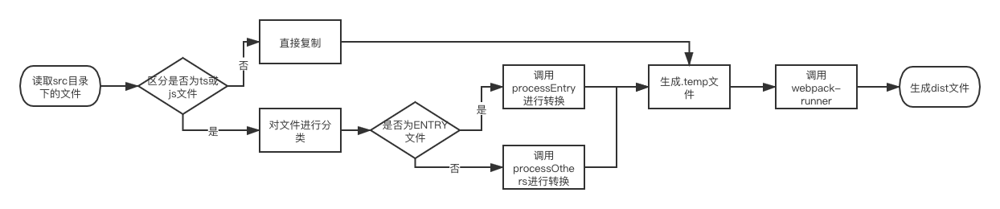
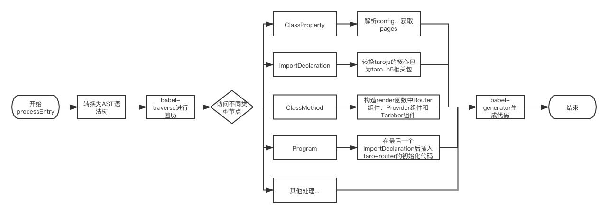

# Taro 1.0系列：taro build原理分析

众所周知，`taro-cli`是Taro脚手架初始化和项目构建的的命令行工具，它的实现原理，相信大家从[Taro 技术揭秘：taro-cli](https://juejin.im/post/5b3ce041e51d45194832aaf6)这篇文章中已经有所了解；本文将对其中的项目构建`build`命令进行分析，从`cli`层面了解`taro`构建的过程到底做了什么；

## build命令的注册

在执行`npm install -g @tarojs/cli`时，`npm`通过读取`package.json`文件中的`bin`字段，将`taro`这个命令注册到`[prefix]/bin`中作为全局命令； 
如果在当前项目目录下，执行`npm install @tarojs/cli`，则会将taro这个命令注册到`./node_modules/.bin/`底下作为本地命令；

```js
// package.json
"bin": {
  "taro": "bin/taro"
}
```

由于`npm config get prefix`为`/usr/local`，所以全局命令将会被注册到`/usr/local`目录底下，通过`symlink`符号链接的方式，使得`/usr/local/bin/taro`指向`/usr/local/lib/node_modules/@tarojs/cli/bin/taro`； 

`bin/taro`文件作为`taro-cli`的入口，内部使用`commander.js`来解析命令中的参数，并且支持`git`风格的子命令处理，可以根据子命令自动引导到`[command]-[subcommand]`格式命名的执行文件； 

所以当执行`taro build`命令时，则被`commander.js`自动引导到`bin/taro-build`文件下，继而执行`bin/taro-build`的逻辑； 

## build命令的分发

`taro build`命令功能非常多，它能够支持：

- 1、构建`H5`；
```sh
taro build --type h5
```
- 2、构建小程序及小程序插件，支持`weapp/swan/alipay/tt/qq/jd`类型；
```sh
// 小程序
taro build --type weapp
// 小程序插件
taro build --plugin weapp
```
- 3、构建UI库；
```sh
cross-env TARO_BUILD_TYPE=component taro build --ui
```

`taro-build`接收`--type`参数的值，接收到的结果交由`dist/build.js`的`build`函数进行判断，通过判断不同`type`的值，决定执行对应平台构建类型的逻辑，例如，当`--type`为`h5`时，则执行`dist/h5/index.js`文件中`build`函数的逻辑；当`--type`为`weapp`时，则执行`dist/mini/index.js`文件中`build`逻辑；

## h5的构建逻辑

`h5`的构建流程主要经过：`源代码` => `中间代码` => `目标代码`的转换； 其中：

- 源代码：一般是指`src`目录底下的代码，如果`config`中有配置`sourceRoot`，则源代码入口就为`sourceRoot`；
- 中间代码：指`.temp`目录下的代码，由`taro-build`实现的中间流程，主要通过`babel`实现中间代码的转换和生成；
- 目标代码：指最终运行在浏览器的代码，一般指`dist`目录下的代码，如果`config`中配置`outputRoot`，则目标代码将输出在`outputRoot`；

所以，三种代码间的转换关系可以用下图表示：


`taro-build`帮助将源代码转换成中间代码，并保存在`.temp`文件夹中，中间代码再交由`webpack`进行打包构建生成目标代码；

### 中间代码的生成

为什么会有中间代码生成这个步骤呢，这是因为：
- 直接将`源代码`交由`webpack`进行编译，会出现部分方法的缺失、页面无法找到等的问题；
- `Taro`需要根据构建平台的类型进行一系列的`转换`，并导入对应平台的核心包；
- 还需要根据工程或者页面的`config`对`源代码`进行转换，并插入一些`关键代码`；

中间代码的生成流程需要转换的代码主要以`src`目录下的代码为主，而且只分析和转换js和ts的文件，因为涉及到代码的分析，所以借助了`babel`工具链，例如`babel-core`、`babel-traverse`、`babel-types`和`babel-template`等核心包中的方法进行处理，主要流程如下：

- 1、区分是否为`js或ts`，是则进行分析，否则直接复制；
- 2、分析文件是否为`ENTRY文件`，`PAGE文件`，`NORMAL文件`，分类完成，则交由对应的处理函数进行处理；
- 3、处理解析`ENTRY文件`；
- 4、处理解析`PAGE文件`和`NORMAL文件`；
- 5、处理完后的代码生成到`.temp`文件夹中；
- 6、调用`webpack-runner`，对`.temp`文件的代码进行处理，生成到`dist`文件夹中；



### 文件的分析

`ENTRY类型`的文件，由`processEntry`函数处理，通过`babel-traverse`中的traverse方法对不同类型的AST节点进行分析，其中涉及到很多细节，主要流程如下：

- 1、解析`config`这个`ClassProperty`节点的内容，获取`pages`和`subPages`;
- 2、依赖纠正：主要转换`tarojs/taro`、`tarojs/mobx`、`tarojs/redux`相关依赖为`tarojs/taro-h5`、`tarojs/mobx-h5`、`tarojs/redux-h5`；转换`ImportDeclaration`节点中的`alias`别名；引入`Nervjs`核心包；
- 3、在`render`函数中，加入页面的`Router`组件(根据`pages`和`subPages`)，`Provider`组件，`Tabbar`组件；
- 4、引入`taro-router`相关代码；



`PAGE类型`和`NORMAL类型`的文件，由`processOthers`函数处理，也是通过`babel-traverse`中的traverse方法对不同类型的AST节点进行分析，这里只列出主要流程：

- 1、依赖纠正：主要转换`tarojs/taro`、`tarojs/mobx`、`tarojs/redux`相关依赖为`tarojs/taro-h5`、`tarojs/mobx-h5`、`tarojs/redux-h5`；转换`ImportDeclaration`节点中的`alias`别名；引入`Nervjs`核心包；
- 2、解析`config`这个`ClassProperty`节点的内容，获取配置项，对页面添加相关的组件和函数，例如`PullDownRefresh`组件和`onPageScroll`方法;
- 3、导出纠正：当前类的`nameExport`纠正为`defaultExport`，例如：当前文件`page-index.js`

```js
// 纠正前
export class PageIndex extends Component {
  ...
}

// 纠正后
class PageIndex extends Component {
  ...
}

export default PageIndex;
```

- 4、声明纠正：当前`ClassExpression`或`ClassDeclaration`中，在没有`identifier`的情况下，添加默认的`identifier`为`_TaroComponentClass`：

```js
// 纠正前
export default class extends Component {
  ...
}

// 纠正后
export default class _TaroComponentClass extends Component {
  ...
}
```

### webpack-runner逻辑

中间代码生成后，缓存在`.temp`文件夹底下，并且作为`webpack-runner`的入口文件，`taro-build`在完成`buildTemp`的流程后，就会继续执行调用`webpack-runner`的逻辑；`webpack-runner`的逻辑实际上就是根据定义好的`webpack`的配置，生成目标代码的流程，后面将会有单独的一篇文章详述相关配置，这里不做再多的描述；

## 小程序的构建逻辑

`taro-build`的小程序构建逻辑不存在中间代码的生成，而是直接由`源代码`生成小程序能运行的`目标代码`；这里的源代码是指遵循`React`规范的taro代码，这种代码在小程序的容器中是无法直接运行的，所以需要通过`taro-build转换`成小程序可运行的代码，因此在这个流程中涉及大量的`AST语法解析和转换`； 

小程序的构建流程主要分三步完成(当然这里还有很多细节，但本文暂不详细阐述)：

- 构建入口：指构建`sourceDir`指定的文件，默认是`app.jsx`文件，构建的逻辑由`buildEntry`函数完成；
- 构建页面：指构建在`app.jsx`文件中的`config.pages`配置好的页面文件，主要由`buildPages`函数完成；
- 构建组件：指构建页面文件中依赖的组件，主要由`buildSingleComponent`函数完成；

构建流程需要依赖`taro-transformer-wx`包去解析`JSX`语法，已经对源代码的`AST语法树`，进行代码插入和转换；

### buildEntry逻辑

构建入口的逻辑大概如下：

- 1、调用`taro-transformer-wx`中的`wxTransformer`方法转换`JSX语法`；
- 2、将`app.jsx`中的`es6`语法通过`babel`转换为`es5`，并且引入`taro-weapp`核心包；
- 3、通过AST转换，插入调用`taro-weapp`包中`createApp`函数的语句；
- 4、生成`app.json`、`app.js`、`app.wxss`文件；

### buildPages逻辑

构建页面的逻辑大概如下：

- 1、调用`taro-transformer-wx`中的`wxTransformer`方法转换`JSX语法`；
- 2、将页面js中的`es6`语法通过`babel`转换为`es5`，并且引入`taro-weapp`核心包；
- 3、通过AST转换，插入调用`taro-weapp`包中`createComponent`函数的语句；
- 4、编译页面所依赖的组件文件，由`buildDepComponents`函数实现；
- 5、生成页面对应的`page.json`、`page.js`、`page.wxss`、`page.wxml`文件；

### buildComponent逻辑

构建组件与构建页面类似，但多了递归的步骤，其逻辑大概如下：

- 1、调用`taro-transformer-wx`中的`wxTransformer`方法转换`JSX语法`；
- 2、将组件js中的`es6`语法通过`babel`转换为`es5`，并且引入`taro-weapp`核心包；
- 3、通过AST转换，插入调用`taro-weapp`包中`createComponent`函数的语句；
- 4、`递归`编译组件所依赖的组件文件，由`buildDepComponents`函数实现；
- 5、生成页面对应的`page.json`、`page.js`、`page.wxss`、`page.wxml`文件；

### taro-transformer-wx

`taro`将`JSX`解析到小程序模板的逻辑，单独拆成一个包`taro-transformer-wx`，里面涉及到大量的AST解析和转换，本文由于篇幅的关系，暂时不详细分析，希望后面会有单独的文章去分析`小程序AST转换的流程`，敬请期待；

## 结语

总的来说，从`cli`层面去看taro的构建流程，会发现为了兼容多平台，taro会使用较多的`AST解析和转换`，帮助将`React`规范的taro代码转换到对应平台能够运行的代码；这里也告诉我们，作为一个前端er，学习和掌握`AST`相关知识，能让你看到更大的世界！ 

最后，本文作为一篇原理分析的文章，如有疏漏以及错误，欢迎大家批评指正！