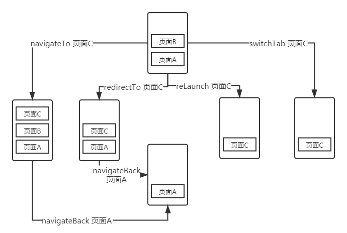
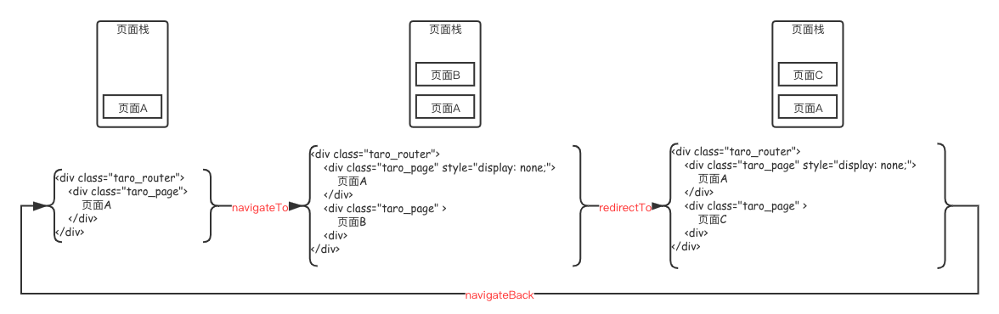

# Taro 1.0系列：taro-router原理分析

## Taro如何处理页面路由

为了多端统一的初衷，`Taro`在路由跳转的交互体验上，保持了小程序端和h5端的统一，即同一套代码，在h5和小程序端的跳转体验是一致的；如何理解`Taro处理页面路由`的方式，我们可以通过一个页面栈来表示路由的状态变化，`Taro`封装了多个路由API，每次调用路由API，都是对页面栈的一次进栈出栈操作：

- `Taro.navigateTo`：保留当前页面，并跳转到应用内某个页面，相当于把新页面`push`进页面栈；
- `Taro.redirectTo`：关闭当前页面，并跳转到应用内某个页面，相当于用新的页面替换掉旧的页面；
- `Taro.switchTab`：跳转到`tabBar`页面，目前h5不支持；
- `Taro.reLaunch`：关闭所有页面，打开到应用内的某个页面，相当于清空页面栈，并且将新页面`push`进栈底；
- `Taro.navigateBack`：关闭当前页面，返回上一页面或多级页面，相当于将页面`pop`出页面栈；

可以通过下图更加直观表示上述API和页面栈的关系：



在小程序端，Taro路由API将直接转换成调用原生路由API，也就是说，在微信小程序中，源代码中调用`Taro.navigateTo`，最终调用的是`wx.navigateTo`；而在H5端，Taro路由API将转换成调用`window.history`对象的API； 

那在H5端如何`管理页面栈和页面状态`，以及页面切换后，如何`加载和卸载页面(页面更新)`等的问题，将由本文的主角`taro-router`进行处理； 

## 页面栈的管理

众所周知，`Taro H5端`是一个单页应用，其路由系统基于浏览器的`history`路由（更多关于单页应用的原理，推荐看看[这篇文章](https://zhuanlan.zhihu.com/p/31876075)）； 

> 这里我们要记住`history API`中的`history.pushState`、`history.replaceState`、`history.go`还有`popstate事件`这几个关键API，是整个路由系统的关键；

而基于`history`的单页应用一般面临着下面的问题： 

- 单页应用内页面切换，怎么`处理状态`并且如何`更新页面`；
- 页面刷新后，如何恢复当前页面，而不是回到最开始的状态；

解决上述两个问题，`taro-router`内部实现一套页面管理机制，在内部管理一套页面状态，并且根据状态变更，决定页面的`新增、替换、删除`；在`状态变更`的同时，根据页面的url路径，决定需要更新的页面组件；更新的页面由页面栈负责管理，页面栈管理页面的层级关系； 

在`taro-router`中，调用API进行页面跳转时，可以观察到`Dom`节点有如下的变化：



可以看到每个页面由`<div class="taro_page"></div>`节点包裹，而所有的页面节点`<div class="taro_router"></div>`节点包裹；在这里：

- `<div class="taro_page"></div>`节点可以理解为页面栈，在`taro-router`中，对应着`Router`组件；
- `<div class="taro_router"></div>`节点可以理解为页面，在`taro-router`中，对应着`Route`组件，它的实际作用是包裹真正的页面组件；

`Router`会在`taro-build`的`ENTRY文件`解析阶段，通过AST解析，将组件插入到`render`函数中，插入口的代码类似（可以在`.temp`文件中查看）：

```js
// 入口文件
class App extends Component {

  render() {
    return <Router mode={"hash"} history={_taroHistory} routes={[{
      path: '/pages/demo/index',
      componentLoader: () => import( /* webpackChunkName: "demo_index" */'./pages/demo/index'),
      isIndex: true
    }, {
      path: '/pages/index/index',
      componentLoader: () => import( /* webpackChunkName: "index_index" */'./pages/index/index'),
      isIndex: false
    }]} customRoutes={{}} />;
  }
}
```

在页面状态变化后，会通过`taro-router`中的`TransitionManager`通知`Router`组件去操作页面栈，`TransitionManager`类似`观察者模式`，`Router`组件属于它的订阅者，它的发布者在后面`页面状态的管理`会提及到；在`Router`组件内部，通过`routeStack`变量来管理页面栈，它通过一个数组来实现；

> 另外`currentPages`同样也是页面栈的另外一个实现，它的变化发生在页面栈中页面实例初始化后，通过`collectComponents`收集；这个变量是对外暴露的，使用方式类似小程序中的`getCurrentPages`，在Taro中则可以调用`Taro.getCurrentPages`API；

`Router`组件当收到`TransitionManager`发布的事件后，根据其回调函数中的三个参数`fromLocation, toLocation, action`作进一步处理：

- fromLocation 表示
- toLocation 表示
- action 表示

## 页面更新

内部维护一套history状态

业务代码中使用history api进行pushState，这个状态将不再内部维护的history状态中

## 页面状态的管理

## 路由拦截的实现

beforeRouteLeave


问题：

1、为什么在mode hash下使用window location href跳转路由，会触发hashchange

2、使用mode browser跳路由，会再向服务器发送请求吗？如果会，那mode hash会吗