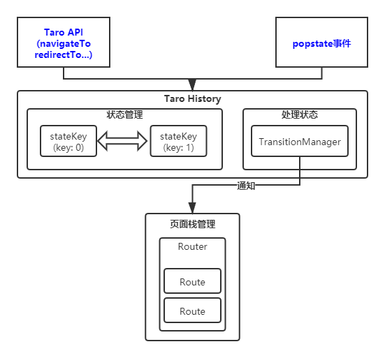
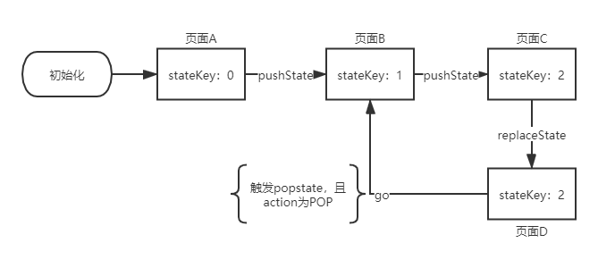

# Taro 1.0系列：taro-router原理分析

## Taro如何处理页面路由

为了多端统一的初衷，`Taro`在路由跳转的交互体验上，保持了小程序端和h5端的统一，即同一套代码，在h5和小程序端的跳转体验是一致的；如何理解`Taro处理页面路由`的方式，我们可以通过一个页面栈来表示路由的状态变化，`Taro`封装了多个路由API，每次调用路由API，都是对页面栈的一次进栈出栈操作：

- `Taro.navigateTo`：保留当前页面，并跳转到应用内某个页面，相当于把新页面`push`进页面栈；
- `Taro.redirectTo`：关闭当前页面，并跳转到应用内某个页面，相当于用新的页面替换掉旧的页面；
- `Taro.switchTab`：跳转到`tabBar`页面，目前h5不支持；
- `Taro.reLaunch`：关闭所有页面，打开到应用内的某个页面，相当于清空页面栈，并且将新页面`push`进栈底；
- `Taro.navigateBack`：关闭当前页面，返回上一页面或多级页面，相当于将页面`pop`出页面栈；

可以通过下图更加直观表示上述API和页面栈的关系：


在小程序端，Taro路由API将直接转换成调用原生路由API，也就是说，在微信小程序中，源代码中调用`Taro.navigateTo`，最终调用的是`wx.navigateTo`；而在H5端，Taro路由API将转换成调用`window.history`对象的API； 

那在H5端如何`管理页面栈和页面状态`，以及页面切换后，如何`加载和卸载页面(页面更新)`等的问题，将由本文的主角`taro-router`进行处理； 

## 页面栈的管理

众所周知，`Taro H5端`是一个单页应用，其路由系统基于浏览器的`history`路由（更多关于单页应用的路由原理，推荐看看[这篇文章](https://zhuanlan.zhihu.com/p/31876075)）； 

> 这里我们要记住`history API`中的`history.pushState`、`history.replaceState`、`history.go`还有`popstate事件`这几个关键API，是整个路由系统的关键；

而基于`history`的单页应用一般面临着下面的问题： 

- 单页应用内页面切换，怎么`处理状态`并且如何`更新页面`；
- 页面刷新后，如何恢复当前页面，而不是回到最开始的状态；

解决上述两个问题，`taro-router`内部实现一套页面管理机制，在内部管理一套页面状态，并且根据状态变更，决定页面的`新增、替换、删除`；在`状态变更`的同时，根据页面的url路径，决定需要更新的页面组件；更新的页面由页面栈负责管理，页面栈管理页面的层级关系； 

在`taro-router`中，调用API进行页面跳转时，可以观察到`Dom`节点有如下的变化：


可以看到每个页面由`<div class="taro_page"></div>`节点包裹，而所有的页面节点`<div class="taro_router"></div>`节点包裹；在这里：

- `<div class="taro_page"></div>`节点可以理解为页面栈，在`taro-router`中，对应着`Router`组件；
- `<div class="taro_router"></div>`节点可以理解为页面，在`taro-router`中，对应着`Route`组件，它的实际作用是包裹真正的页面组件；

`Router`会在`taro-build`的`ENTRY文件`解析阶段，通过AST解析，将组件插入到`render`函数中，插入口的代码类似（可以在`.temp`文件中查看）：

```js
// 入口文件
class App extends Taro.Component {

  render() {
    return <Router mode={"hash"} history={_taroHistory} routes={[{
      path: '/pages/demo/index',
      componentLoader: () => import( /* webpackChunkName: "demo_index" */'./pages/demo/index'),
      isIndex: true
    }, {
      path: '/pages/index/index',
      componentLoader: () => import( /* webpackChunkName: "index_index" */'./pages/index/index'),
      isIndex: false
    }]} customRoutes={{}} />;
  }
}
```

在页面状态变化后，会通过`taro-router`中的`TransitionManager`通知`Router`组件去操作页面栈，`TransitionManager`类似`观察者模式`，`Router`组件属于它的订阅者，它的发布者在后面`页面状态的管理`会提及到；在`Router`组件内部，通过`routeStack`变量来管理页面栈，它通过一个数组来实现；

> 另外`currentPages`同样也是页面栈的另外一个实现，它的变化发生在页面栈中页面实例初始化后，通过`collectComponents`收集；这个变量是对外暴露的，使用方式类似小程序中的`getCurrentPages`，在Taro中则可以调用`Taro.getCurrentPages`API；

`Router`组件当收到`TransitionManager`发布的事件后，根据其回调函数中的三个参数`fromLocation, toLocation, action`作进一步处理：

- fromLocation 表示从哪个路径跳转；
- toLocation 表示跳转到哪个路径；
- action 表示跳转的动作，包含`PUSH、POP、REPLACE`；

根据返回的`PUSH、POP、REPLACE`动作类型，对页面栈`routeStack`进行页面的入栈、出栈、替换处理；

### PUSH动作

当监听到的action为`PUSH`时：

- 首先会对`toLocation`进行匹配，目的是为了找到对应的`route`对象，`route`对象包含`path, componentLoader, isIndex`等等的信息，其中`componentLoader`指向了要加载的页面组件；
- 随后，会将匹配到的`route`对象`matchedRoute`加入到`routeStack`中；
- 最后通过调用`setState`进行更新；

```js
push (toLocation) {
  const routeStack= [...this.state.routeStack]
  const matchedRoute = this.computeMatch(toLocation)
  routeStack.forEach(v => { v.isRedirect = false })
  routeStack.push(assign({}, matchedRoute, {
    key: toLocation.state.key,
    isRedirect: false
  }))
  this.setState({ routeStack, location: toLocation })
}
```

### POP动作

当监听到的action为`POP`时：

- 首先，根据`fromLocation`和`toLocation`的`key`值之差，决定在要页面栈中回退多少个页面；
- 计算出的差值为`delta`，再通过`splice`进行删除；
- 删除操作完成后，检查页面栈的长度是否为0，若为0，则将`toLocation`对应的页面推入页面栈；
- 最后通过调用`setState`进行更新；

```js
pop (toLocation, fromLocation) {
  let routeStack = [...this.state.routeStack]
  const fromKey = Number(fromLocation.state.key)
  const toKey = Number(toLocation.state.key)
  const delta = toKey - fromKey

  routeStack.splice(delta)

  if (routeStack.length === 0) {
    // 不存在历史栈, 需要重新构造
    const matchedRoute = this.computeMatch(toLocation)
    routeStack = [assign({}, matchedRoute, {
      key: toLocation.state.key,
      isRedirect: false
    })]
  }

  this.setState({ routeStack, location: toLocation })
}
```

### REPLACE动作

当监听到的action为`RELPLACE`时：

- 首先会对`toLocation`进行匹配，找到对应的`route`对象`matchedRoute`；
- 删除页面栈栈顶的`route`对象，替换为`matchedRoute`；
- 最后通过调用`setState`进行更新；

```js
replace (toLocation) {
  const routeStack = [...this.state.routeStack]
  const matchedRoute = this.computeMatch(toLocation)
  // 替换
  routeStack.splice(-1, 1, assign({}, matchedRoute, {
    key: toLocation.state.key,
    isRedirect: true
  }))
  this.setState({ routeStack, location: toLocation })
}
```

## 页面更新

在获知具体的页面栈动作之后，`routeStack`对象将会发生变化，`routeStack`的更新，也会触发`Route`组件数量的变化；

> 上文提及到，Route组件是具体页面的包裹

`Router`组件的`render`函数中，根据`routeStack`的大小，渲染对应的`Route`组件：
```js
render () {
  const currentLocation = Taro._$router
  return (
    <div
      className="taro_router"
      style={{ height: '100%' }}>
      {this.state.routeStack.map(({ path, componentLoader, isIndex, isTabBar, key, isRedirect }, k) => {
        return (
          <Route
            path={path}
            currentLocation={currentLocation}
            componentLoader={componentLoader}
            isIndex={isIndex}
            key={key}
            k={k}
            isTabBar={isTabBar}
            isRedirect={isRedirect}
            collectComponent={this.collectComponent}
          />
        )
      })}
    </div>
  )
}
```

在`Route`组件实例初始化后，将会调用组件内`updateComponent`方法，进行具体页面的拉取：

```js
updateComponent (props = this.props) {
  props.componentLoader()
    .then(({ default: component }) => {
      if (!component) {
        throw Error(`Received a falsy component for route "${props.path}". Forget to export it?`)
      }
      const WrappedComponent = createWrappedComponent(component)
      this.wrappedComponent = WrappedComponent
      this.forceUpdate()
    }).catch((e) => {
      console.error(e)
    })
}
```

是否记得在入口文件中插入的代码：

```js
<Router mode={"hash"} history={_taroHistory} routes={[{
  path: '/pages/demo/index',
  componentLoader: () => import( /* webpackChunkName: "demo_index" */'./pages/demo/index'),
  isIndex: true
}, {
  path: '/pages/index/index',
  componentLoader: () => import( /* webpackChunkName: "index_index" */'./pages/index/index'),
  isIndex: false
}]} customRoutes={{}} />;
```

`componentLoader`字段传入的是一个`dynamic import`形式的函数，它的返回是一个`Promise`，这样就可以对应上`updateComponent`中`props.componentLoader()`的调用了，它的`then`回调中，表示这个`dynamic import`对应的模块已经成功加载，可以获取该模块导出的`component`了；获取导出的`component`后，经过包装再触发强制更新，进行渲染；

## 页面状态的管理

`taro-router`其内部维护一套页面状态，配合浏览器的`history`API进行状态管理；内部实例化`TransitionManager`，用于当页面状态变化后，通知订阅者更新页面；

### 初始化流程

在`taro-build`的`ENTRY文件`解析阶段，会在`app.jsx`文件中插入`taro-router`的初始化代码：

```js
const _taroHistory = createHistory({
  mode: "hash",
  basename: "/",
  customRoutes: {},
  firstPagePath: "/pages/demo/index"
});

mountApis({
  "basename": "/",
  "customRoutes": {}
}, _taroHistory);
```

在初始化代码中，会首先调用`createHistory`方法，然后调用`mountApi`将路由API(如：`navagateTo`、`redirectTo`)挂载到`Taro`实例下；下面就讲一下`createHistory`方法的流程：

> 如果有看过[history](https://github.com/ReactTraining/history)这个仓库的同学，应该会更容易理解`taro-router`初始化流程，因为初始化流程跟`history`的逻辑很像；

- 首先初始化`TransitionManager`，用于实现发布者订阅者模式，通知页面进行更新；
- 获取初始化的`history state`，如果从`window.history.state`中能获取`key`，则使用该`key`，否则使用值为`'0'`的`key`值；
- 将上一步初始化出来的`state`通过`window.history.replaceState`进行历史记录的替换；
- 监听`popstate`事件，在回调函数中，对返回的`state`对象中的`key`值进行比较，通过比较得出需要进行的`action`，并将这个`action`通过`TransitionManager`通知到`Router`组件；

结合页面栈管理以及页面更新的逻辑，可以把整个`taro-router`的结构描述如下：



### 状态变化过程

`taro-router`维护的页面状态，保存内部的`stateKey`变量中，并且用于history对象的state中； 

- 在首次进入单页应用时，`stateKey`会被赋予初始值`0`；
- 当每次进行`pushState`时，会触发`stateKey`自增`1`；
- 进行`replaceState`时，`stateKey`保持不变；
- `popstate`触发时，回调函数会返回最新的`stateKey`，根据`前后两次stateKey`的比较，决定页面的action；

状态变化流程如下图：



> 注意：当业务代码中使用history api进行pushState，这个状态将不在taro-router内部维护的history状态中，甚至会影响到taro-router的逻辑；

例如：在业务代码中调用`window.history.pushState`插入一个状态： 

```js
class Index extends Taro.Component {
  componentDidMount() {
    window.history.pushState({ key: 'mock' }, null, window.location.href);
  }
};
```

假设在插入该状态前，history的state为`{ key: '1' }`；此时，用户触发返回操作，浏览器`popstate`事件被触发，这个时候，就会执行`taro-router`的`handlePopState`方法：

```js
// 此处只保留关键代码
const handlePopState = (e) => {
    const currentKey = Number(lastLocation.state.key)
    const nextKey = Number(state.key)
    let action: Action
    if (nextKey > currentKey) {
      action = 'PUSH'
    } else if (nextKey < currentKey) {
      action = 'POP'
    } else {
      action = 'REPLACE'
    }

    store.key = String(nextKey)

    setState({
      action,
      location: nextLocation
    })
  }
```

在比较`nextKey`和`currentKey`时，就出现了`1`和`mock`的比较，从而导致不可预计的`action`值产生；

## 路由拦截的实现

路由拦截，是指在路由进行变化时，能够拦截路由变化前的动作，保持页面不变，并交由业务逻辑作进一步的判断，再决定是否进行页面的切换； 

在`Vue`里面，我们比较熟悉的`路由拦截`API就有`vue-router`的`beforeRouteLeave`和`beforeRouteEnter`；在`React`当中，就有`react-router-dom`的`Prompt`组件；

文中一开始的时候，就提到`Taro`在路由跳转的交互体验上，保持了小程序端和h5端的统一，因此小程序中没有实现的路由拦截，H5端也没有实现； 

> 那么，在`taro-router`中是否就真的不能做到路由拦截呢？

答案是`否定的`，作者本人从`vue-router`和`react-router-dom`以及`history`中得到灵感，在`taro-router`是实现了`路由拦截`的API`beforeRouteLeave`，大家可以查看相关[commit](https://github.com/NervJS/taro/commit/10c2c53a57c537d950268d98886f4763d4b92807)； 

只有在页面中声明该拦截函数，页面才具有路由拦截功能，否则页面不具有拦截功能，该函数有三个参数分别为**from**，**to**，**next**
- from：表示从哪个Location离开
- to：表示要跳转到哪个Location
- next: 函数，其入参为boolean；next(true)，表示继续跳转下一个页面，next(false)表示路由跳转终止

它的使用方式是：

```js
import Taro, { Component } from '@tarojs/taro'
import { View, Button } from '@tarojs/components'

export default class Index extends Component {

  beforeRouteLeave(from, to, next) {
    Taro.showModal({
      title: '确定离开吗'
    }).then((res) => {
      if (res.confirm) {
        next(true);
      }

      if (res.cancel) {
        next(false);
      }
    })
  }

  render () {
    return (
      <View>
        <Button onClick={() => {
          Taro.navigateBack();
        }}>返回</Button>
      </View>
    )
  }
}
```

它的实现原理是借助`TransitionManager`中的`confirmTransitionTo`函数，在通知页面栈更新前，进行拦截；

```js

// 此处只保留关键代码
const handlePopState = (e) => {
  const currentKey = Number(lastLocation.state.key)
  const nextKey = Number(state.key)
  const nextLocation = getDOMLocation(state)
  let action: Action
  if (nextKey > currentKey) {
    action = 'PUSH'
  } else if (nextKey < currentKey) {
    action = 'POP'
  } else {
    action = 'REPLACE'
  }

  store.key = String(nextKey)

  // 拦截确认
  transitionManager.confirmTransitionTo(
    nextLocation,
    action,
    (result, callback) => {
      getUserConfirmation(callback, lastLocation, nextLocation)
    },
    ok => {
      if (ok) {
        // 通知页面更新
        setState({
          action,
          location: nextLocation
        })
      } else {
        revertPop()
      }
    }
  )
}
```

拦截过程中，调用`getUserConfirmation`函数获取页面栈中`栈顶`的页面实例，并且从页面实例中获取`beforeRouteLeave`函数，调用它以获取`是否继续执行路由拦截`的结果；

```js
function getUserConfirmation(next, fromLocation, toLocation) {
  // 获取栈顶的Route对象
  const currentRoute = getCurrentRoute() || {}
  const leaveHook = currentRoute.beforeRouteLeave

  if (typeof leaveHook === 'function') {
    tryToCall(leaveHook, currentRoute, fromLocation, toLocation, next)
  } else {
    next(true)
  }
}
```

## 结语

至此，`taro-router`的原理已经分析完，虽然里面依然有不少细节没有提及，但是主要的思路和逻辑，已经梳理得差不多，因此篇幅较长；希望大家读完后，能有所收获，同时也希望大家如发现其中疏漏的地方能批评指正，谢谢！